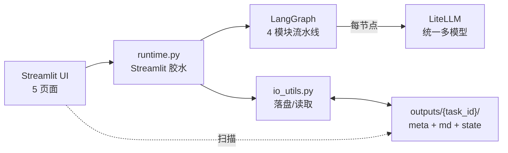

# 业务智能体 (Business Agent)

> 把技术说给用户听 — 基于 LangGraph + LiteLLM + Streamlit 的 4 模块业务智能体

给定一份"技术部"给你的原始技术资料，自动产出：

1. 用户能听懂的**技术翻译**
2. 用户可理解+用户需要的**技术卖点（技术IP）**
3. 围绕技术IP 的**推广策略**
4. 具体的**营销内容与活动方案**

支持**全自动**与**人工审核**两种模式，多模型自由切换（OpenAI / Anthropic / DeepSeek / 通义千问 等）。

---

## 一分钟跑起来

```bash
# 1. 克隆到本地后，安装依赖
pip install -r requirements.txt

# 2. 复制环境变量模板并填入你的 API Key（至少一家）
cp .env.example .env
# 然后用编辑器打开 .env，填入 OPENAI_API_KEY / DEEPSEEK_API_KEY 等

# 3. 启动 Streamlit
streamlit run app.py
```

首次启动后浏览器会自动打开 `http://localhost:8501`。

如果你还没有 API Key，可以先通过"⚙️ 模型与设置"页面添加。

---

## 技术架构



### 4 个模块

| 模块 | 角色 | 核心产出 |
|------|------|----------|
| M1 | 技术翻译官 | `tech_points[]` · `capabilities[]` · `boundaries[]` |
| M2 | 技术卖点包装师 | `core_claim` · `selling_points[]` · `target_user_hypothesis[]` · `filtered_points[]` |
| M3 | 推广策略规划师 | `target_audiences[]` · `core_channels[]` · `content_matrix[]` · `phases[]` · `kpis[]` |
| M4 | 营销内容策划师 | `campaign_theme` · `slogan` · `video_scripts[]` · `article` · `social_posts[]` · `posters[]` · `offline_event` |

**技术IP 的定义**：基于原始技术包装出来的、用户可理解 + 用户需要的技术卖点集合（不是品牌人设 / Slogan / 视觉关键词，这些留给 M4 的营销内容包装）。

完整数据契约见 [`src/state.py`](src/state.py)。

---

## 目录结构

```
training/
├── app.py                    # Streamlit 主入口（首页）
├── pages/                    # Streamlit 多页面
│   ├── 1_workspace.py        # 新建 & 运行（工作台）
│   ├── 2_result.py           # 结果详情
│   ├── 3_history.py          # 历史记录
│   └── 4_settings.py         # 模型与 API 设置
├── src/
│   ├── state.py              # WorkflowState 数据契约
│   ├── graph.py              # LangGraph 构图（auto / review）
│   ├── runtime.py            # Streamlit ↔ LangGraph 胶水层
│   ├── llm.py                # LiteLLM 统一调用（多 provider + JSON 解析 + 重试）
│   ├── io_utils.py           # 文件读写 / 落盘 / 历史扫描 / Markdown 渲染
│   ├── config_utils.py       # .env + config.yaml 读写
│   ├── nodes/                # 4 个模块节点
│   │   ├── translator.py
│   │   ├── ip_builder.py
│   │   ├── strategist.py
│   │   └── marketer.py
│   └── ui/                   # 前端设计系统
│       ├── components.py     # Material Design 组件库
│       ├── layout.py         # 侧边栏/页眉
│       └── mocks.py          # 开发期样本数据
├── prompts/                  # 4 个模块的 Prompt 模板（Markdown）
│   ├── translator.md
│   ├── ip_builder.md
│   ├── strategist.md
│   └── marketer.md
├── styles/
│   └── global.css            # Material Design 3 浅色样式
├── scripts/
│   └── smoke_backend.py      # 后端冒烟测试（无需真实 LLM）
├── outputs/                  # 任务产物目录（自动生成）
│   └── {task_id}/
│       ├── meta.json
│       ├── state.json
│       ├── m1.md ... m4.md
│       └── report.md         # 合并报告
├── config.yaml               # 模型注册表 + 默认配置（非敏感）
├── .env.example              # API Key 模板
├── requirements.txt
├── 业务智能体实施规划.md       # 完整的产品 / 技术规划
└── 前端设计稿.md              # 前端设计系统 + 5 页面 wireframe
```

---

## 使用指南

### 模式切换

| 模式 | 适合场景 | 行为 |
|------|----------|------|
| 🤖 **全自动** | 快速出初稿、批量处理 | 一次性跑完 4 个模块，最后直接跳转结果页 |
| 🧑‍⚖️ **人工审核** | 对品质有把控要求、需逐步调优 | 每个模块完成后暂停，可选择 **通过 / 修改后通过 / 重跑本模块** |

默认模式在 [`config.yaml`](config.yaml) 的 `defaults.mode` 指定，工作台也可单次覆盖。

### 支持的模型

LiteLLM 命名规则：`<provider>/<model_id>`

| Provider | 环境变量 | 示例 model_id |
|----------|----------|---------------|
| OpenAI | `OPENAI_API_KEY` | `openai/gpt-4o`, `openai/gpt-4o-mini` |
| Anthropic | `ANTHROPIC_API_KEY` | `anthropic/claude-sonnet-4-5` |
| DeepSeek | `DEEPSEEK_API_KEY` | `deepseek/deepseek-chat` |
| 通义千问 / DashScope | `DASHSCOPE_API_KEY` | `dashscope/qwen-max` |

在「⚙️ 模型与设置 → 模型注册表」可以**启用 / 新增 / 修改**模型。任何 LiteLLM 支持的 provider 都可以通过在注册表加一行来启用。

### 输入

工作台支持两种方式：

- 📎 **上传文件**：txt / md / docx / pdf，自动解析为纯文本
- 📝 **粘贴文本**：直接贴进来即可

### 输出

每次跑完都会在 `outputs/{task_id}/` 下生成：

- `meta.json` — 元信息（历史页扫描的就是它）
- `state.json` — 完整 `WorkflowState` 序列化，可用于"基于此任务重跑"
- `m1.md ~ m4.md` — 每模块的人类可读 Markdown
- `report.md` — 合并为一份完整报告，方便导出/分享

---

## 常见问题

### Q1. 启动报 `No module named 'streamlit'` 等
未安装依赖。执行 `pip install -r requirements.txt`。

### Q2. 某个模块报"未检测到环境变量 xxx_API_KEY"
该模块所选模型对应的 Provider 没配 Key。有两种解决方法：
- 前往「⚙️ 模型与设置 → API Key 管理」填入并保存（会写 `.env`）；
- 或直接编辑 `.env`。

### Q3. 模型返回了不合法的 JSON，看到解析错误
`llm.py` 已内置 `max_retries=2` 的重试（会自动追加"严格 JSON"提示），还是失败就说明模型不适合做结构化输出；建议换用支持 `response_format=json_object` 的模型（如 GPT-4o、DeepSeek-Chat）。

### Q4. 人工审核模式下点"通过"后没有反应
审核状态要求同一个 Streamlit 会话持有 `MemorySaver`（我们用的是内存 checkpointer）。如果你在审核中途**重启了 Streamlit**，会丢失图状态 → 此时请走历史记录页，从上次中断的任务继续（v1 尚未实现跨进程 checkpoint，**建议长任务选全自动模式**）。

### Q5. 我想在不调 LLM 的情况下验证改动
```bash
python scripts/smoke_backend.py
```
会走一遍全自动流水线，使用 mock LLM，落盘到 `outputs/smoke-test-001/`，验证完自动清理。

### Q6. 中文乱码（Windows 控制台）
脚本内已用 `sys.stdout.reconfigure(encoding='utf-8')` 兜底；如果你在 PowerShell 里自己跑别的脚本，也可以先 `$env:PYTHONIOENCODING='utf-8'`。

### Q7. 怎么只跑其中某个模块
最简单：在工作台选"人工审核"模式，跑到目标模块后直接"暂停"；或在审核阶段点"重跑本模块"重新生成该模块。编程方式参见 [`src/graph.py`](src/graph.py) 的 `build_review_graph()`。

---

## 设计理念

- **数据契约优先** — 前后端靠 [`src/state.py`](src/state.py) 的 TypedDict 对齐；Prompt 的输出结构必须与之完全一致
- **Prompt 与代码解耦** — 4 个模块的 Prompt 全部放在 [`prompts/*.md`](prompts/)，调优无需改 Python
- **UI 组件化** — [`src/ui/components.py`](src/ui/components.py) 封装 Material Design 3 风格的 banner / chip / step progress / card 等
- **模拟数据独立** — [`src/ui/mocks.py`](src/ui/mocks.py) 提供完整的 4 种运行态样本，支持前端独立开发
- **持久化直观** — 每个任务的产出就是一个目录，可以 Git、zip、复制粘贴

详细的产品与技术规划见 [业务智能体实施规划.md](业务智能体实施规划.md)，前端设计系统见 [前端设计稿.md](前端设计稿.md)。

---

## 路线图

- [x] v0.1 — 骨架、4 模块、双模式、5 页面、落盘、历史
- [ ] v0.2 — 跨会话 checkpoint（SQLite）、并发任务、Token 成本估算
- [ ] v0.3 — 一键导出 PPT/PDF、模块内嵌测评打分
- [ ] v0.4 — 多语言产出、外部素材资产库接入

---

## License

MIT
