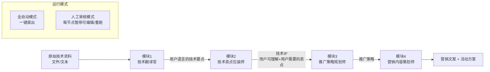

# 业务智能体实施规划

> 本文档为计划稿本地存档。四模块智能体：原始技术资料 → 用户语言 → 技术IP（用户可理解+用户需要的卖点）→ 推广策略 → 营销内容与活动方案。

## 一、技术选型（已确认）

- **编排框架**：LangGraph（原生支持链式工作流 + Human-in-the-loop 中断节点）
- **模型接入**：LiteLLM 统一接口，运行时切换 OpenAI / Claude / DeepSeek / Qwen / Ollama 等（用户自行配置 API Key）
- **前端交互**：Streamlit（侧边栏选模型、上传资料、逐步展示每个模块输出）
- **文件解析**：`python-docx`（Word）、`pypdf`（PDF）、原生读取（txt/md）

## 二、整体架构



四个模块每个都是独立的 LangGraph 节点，节点之间通过共享 State 传递；人工审核模式通过 `interrupt_after` 在每个节点后中断，Streamlit 端展示结果并等待用户"通过/修改/重跑"指令。

## 三、项目结构

```
training/
├── README.md                     # 使用说明
├── requirements.txt              # 依赖
├── .env.example                  # API Key 模板（不入库）
├── config.yaml                   # 可选模型列表、每个模块默认模型
├── app.py                        # Streamlit 主入口
├── src/
│   ├── __init__.py
│   ├── llm.py                    # LiteLLM 封装 + 模型注册表
│   ├── state.py                  # WorkflowState (TypedDict)
│   ├── graph.py                  # LangGraph 构图 + 双模式编译
│   ├── io_utils.py               # 文件读取/导出 Markdown
│   └── nodes/
│       ├── translator.py         # 模块1
│       ├── ip_builder.py         # 模块2
│       ├── strategist.py         # 模块3
│       └── marketer.py           # 模块4
├── prompts/                      # 提示词与代码解耦，便于调优
│   ├── translator.md
│   ├── ip_builder.md
│   ├── strategist.md
│   └── marketer.md
└── outputs/                      # 运行产物（自动生成）
```

## 四、各模块设计

### 模块1：技术翻译官（`translator.py`）
- 输入：原始技术资料文本
- 任务：抽取原始技术中的**技术要点**（参数/原理/架构/工艺/能力边界等）→ 用类比、生活化语言改写成用户听得懂的表达
- 定位：只做"翻译"，保持技术客观性，不做营销裁剪
- 输出（结构化 JSON）：`{技术要点[{原始表述, 通俗表述, 类比举例, 相关参数}], 关键能力清单[], 能力边界/前提[]}`

### 模块2：技术卖点包装师（`ip_builder.py`）— 产出"技术IP"
- **技术IP 的定义（已与用户确认）**：基于原始技术包装出来的、**用户可理解** 且 **用户需要** 的技术卖点集合。不是品牌人设/视觉调性，而是"技术价值主张"。
- 输入：模块1 的转译结果 + 原始技术资料
- 任务链：
  1. 从转译后的技术要点中，**筛选**出真正对用户有价值的点（过滤掉"技术上厉害但用户不关心"的内容）
  2. 将每个卖点**对齐到具体的用户需求/痛点**（为什么用户需要它）
  3. 用用户视角的语言**重新包装**为"技术卖点"
  4. 在多个卖点中识别并提炼 1 个**核心卖点（技术IP主张）**，形成一句话可传播主张
- 输出（结构化 JSON）：

```json
{
  "核心技术IP主张": "一句话可传播的核心卖点",
  "技术卖点列表": [
    {
      "卖点名称": "...",
      "用户语言描述": "用户能听懂的一句话",
      "对应用户需求/痛点": "...",
      "支撑的技术要点": ["引用模块1中的要点"],
      "差异化点": "相比同类/替代方案的独特之处"
    }
  ],
  "目标用户假设": ["这些卖点最能打动的用户群体（供模块3细化）"],
  "不建议对外强调的技术点": ["筛掉的点及原因，供人工复核"]
}
```

- 注意：**不输出** IP 名称、Slogan、人设标签、视觉关键词 等品牌层内容（那属于营销执行层，由模块4处理）

### 模块3：推广策略规划师（`strategist.py`）
- 输入：模块2 输出的**技术IP（核心主张+卖点列表+目标用户假设）** + 模块1 的转译资料
- 任务：围绕技术IP中的核心主张和卖点，制定目标人群细化画像、渠道组合、内容矩阵、节奏规划、KPI
- 输出：`{目标人群画像[], 核心渠道[], 内容矩阵（认知/种草/转化对应的卖点）, 推广阶段（冷启动/爬坡/放量）, 关键KPI}`

### 模块4：营销内容策划师（`marketer.py`）
- 输入：技术IP + 推广策略
- 任务：产出具体可落地的文案与活动方案；**在此处**才引入品牌化表达（例如活动主题名称、Slogan 化的传播语、海报主视觉关键词等），将技术IP卖点转化为具体触达内容
- 输出：`{活动主题与传播语, 短视频脚本[], 公众号文章, 小红书笔记[], 海报文案与视觉关键词[], 线下活动策划（主题/流程/物料/预算框架）}`

## 五、关键实现要点

### 1. 模型可切换 — `src/llm.py`

```python
from litellm import completion
def invoke(model: str, api_key: str, prompt: str, temperature: float = 0.7) -> str: ...
```

- `config.yaml` 维护一份可选模型清单（如 `gpt-4o`, `claude-sonnet-4-5`, `deepseek-chat`, `qwen-max`），UI 侧边栏下拉展示
- 支持**为不同模块配置不同模型**（例如模块1用便宜的 DeepSeek，模块4用 Claude 生成文案）

### 2. 双模式切换与显著提示 — `app.py`

- 侧边栏 `st.radio("运行模式", ["全自动", "人工审核"])`
- 切换模式时：使用 `st.warning` / `st.info` 大号 banner 置顶显示当前模式，并用图标色块区分
  - 全自动：黄色 banner "当前为全自动模式，输入后将一次性完成全部 4 个模块"
  - 人工审核：蓝色 banner "当前为人工审核模式，每个模块完成后会暂停，等待你确认/修改/重跑"
- 模式切换瞬间在聊天区追加一条醒目提示消息，防止用户误操作

### 3. 人工审核的落地方式

- LangGraph 用 `checkpointer=MemorySaver()` + `interrupt_after=["m1","m2","m3","m4"]`
- Streamlit 用 `st.session_state` 保存 `graph` 与 `thread_id`
- 每次中断后，界面显示该节点输出 + 三个按钮：
  - **通过** → `graph.invoke(None, config)` 继续
  - **修改后通过** → 编辑框改完后以新值更新 state 再继续
  - **重跑** → 以相同输入重新执行该节点

### 4. 输入/输出

- 输入：支持 `.txt` / `.md` / `.docx` / `.pdf` 上传 **或** 直接粘贴文本
- 输出：每个模块的结果单独 tab 展示 + 一键复制 + 下载为 Markdown；最终打包为 `outputs/{timestamp}/report.md`

## 六、依赖清单（`requirements.txt` 主要项）

- `langgraph`, `langchain-core`
- `litellm`
- `streamlit`
- `pydantic`
- `python-docx`, `pypdf`
- `python-dotenv`, `pyyaml`

## 七、交付顺序（Todos）

1. **scaffold**：初始化项目骨架（requirements.txt、.env.example、config.yaml、目录结构）
2. **llm_layer**：实现 `src/llm.py`（基于 LiteLLM 的模型统一调用层）与模型注册表
3. **state_io**：实现 `src/state.py`（WorkflowState）与 `src/io_utils.py`（文件读取/Markdown导出）
4. **prompts**：编写 4 个模块的 Prompt 模板（`prompts/*.md`），包含角色、任务、输出 JSON Schema
5. **node_translator**：实现模块1——技术翻译官节点（`translator.py`）
6. **node_ip**：实现模块2——技术卖点包装师节点（`ip_builder.py`），产出"技术IP"
7. **node_strategy**：实现模块3——推广策略规划师节点（`strategist.py`）
8. **node_marketer**：实现模块4——营销内容策划师节点（`marketer.py`）
9. **graph**：实现 `src/graph.py`，LangGraph 构图，支持全自动与 `interrupt_after` 人工审核两种编译产物
10. **ui**：实现 `app.py`，Streamlit 界面（侧边栏模型选择、模式切换的显著提示、文件上传、四个模块分 tab 展示、审核按钮）
11. **readme**：完善 `README.md`，含安装、配置 API Key、运行、模式切换说明、常见问题

---

_本地存档副本；后续若计划更新，建议同步回 `.cursor/plans/business-agent-plan_b57f73a5.plan.md`。_
