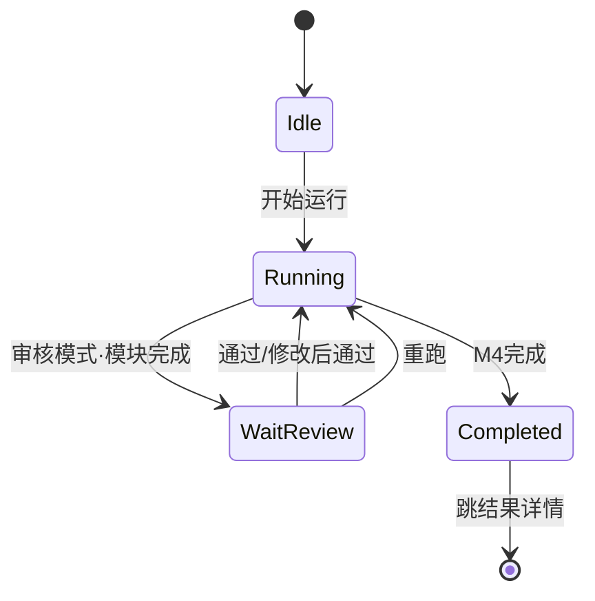

# 业务智能体 · 前端设计稿

本文档是前端 UI 的设计基线，包含：
1. 设计系统（色彩/排版/形状/动效/组件规范）
2. 5 个页面的详细设计规范（布局、组件、交互、数据）
3. 技术实现路线（Streamlit 原生 + 自定义 CSS，浅色模式 v1）

所有后续前端开发以此文档为准；如需调整，先改本文档，再动代码。

---

## 一、设计系统

### 1.1 设计语言总则

- **Material Design 3（Material You）** 风格：圆角、Elevation 层级、4dp/8dp 间距网格
- **简洁**：留白充足，一屏只突出 1 个主要动作
- **科技感**：通过冷色主色 + 细腻渐变 + 等宽字体 + 动效表达，避免视觉堆砌
- **用户友好**：语义化色彩、清晰状态反馈、关键操作 hover 动效、中文首位

### 1.2 色彩系统（浅色模式 v1）

| 角色 | 色值 | 用途 |
|------|------|------|
| Primary | `#0B63E5` | 主按钮、链接、进度条 |
| Primary Container | `#E3EDFF` | 主按钮次级背景、选中态 |
| Secondary | `#00B7C3` | 徽章、图标高亮、科技感点缀 |
| Surface | `#FFFFFF` | 卡片背景 |
| Surface Variant | `#F5F7FA` | 页面背景 |
| On-Surface | `#1A1C1E` | 正文文字 |
| On-Surface Variant | `#6B7280` | 辅助文字、caption |
| Outline | `#E0E3E7` | 边框、分割线 |
| Success | `#1E8E3E` | 完成状态 |
| Warning | `#E37400` | 全自动模式 banner、中断 |
| Error | `#D93025` | 失败、缺配置 |
| Info | `#0288D1` | 人工审核模式 banner |

### 1.3 排版

| 样式 | 字号 / 字重 | 用途 |
|------|------------|------|
| Display | 32px / 600 | 首页欢迎语 |
| Headline | 24px / 600 | 页面主标题 |
| Title | 18px / 600 | 区块标题（卡片内） |
| Body | 15px / 400 | 正文 |
| Body Small | 13px / 400 | 辅助说明、caption |
| Label | 13px / 500 | 按钮文字、标签 |
| Mono | 13px / 400 | 技术参数、代码、JSON |

**字体栈**：
- 中文：`PingFang SC`, `Microsoft YaHei`, `Noto Sans SC`
- 英文/数字：`Inter`, `Roboto`
- 等宽：`JetBrains Mono`, `Fira Code`, `Consolas`

### 1.4 形状与间距

- **圆角**：按钮 20px（pill）/ 卡片 12px / 输入框 8px / 徽章 999px
- **间距网格**：4 / 8 / 12 / 16 / 24 / 32 px（4dp 倍数）
- **Elevation**：
  - Level 0：无阴影
  - Level 1：`0 1px 2px rgba(0,0,0,.04), 0 1px 3px rgba(0,0,0,.06)`
  - Level 2：`0 2px 6px rgba(0,0,0,.06), 0 8px 20px rgba(0,0,0,.08)`

### 1.5 核心组件样式

**Buttons**
- Filled：主色渐变 `linear-gradient(135deg, #0B63E5, #0052CC)` + 白字 + hover 上浮 1px
- Outlined：透明背景 + 主色描边 + 主色文字
- Text：无背景 + 主色文字
- 统一高度 40px，圆角 20px，字号 14px/500

**Cards**
- 白底，圆角 12px，Elev-1，内边距 24px
- hover → Elev-2 + 上浮 1px
- 科技感版本：左侧 4px 主色→青色渐变条

**Progress**
- Linear：高度 4px，主色，完成段流光动效
- Step Progress（四模块步骤条核心组件）：圆形节点 32px + 连接线 4px，四态色：灰/主色脉冲/绿/黄

**Inputs**
- 高度 44px，圆角 8px，1px 灰边
- focus：主色描边 2px + 淡光晕
- Material 浮动 label

**Banner（模式提示）**
- 满宽，高度 48px，圆角 8px，左侧 4px 色条
- 全自动：warning 浅黄底；人工审核：info 浅蓝底

**Chips / Badges**
- 高度 24px，圆角 999px
- 状态胶囊带 8px 圆点

### 1.6 动效规范（Material Motion）

- Standard easing：`cubic-bezier(0.2, 0, 0, 1)`，200–300ms
- 按钮 hover：`transform: translateY(-1px)` + Elev-2
- 卡片 hover：阴影升级，背景色微亮
- 运行中模块卡片：左侧色条 2s 呼吸脉冲
- 页面切换：淡入 150ms

### 1.7 科技感点睛元素

1. **顶部渐变线**：App 最顶端 2px 高度 `linear-gradient(90deg, #0B63E5, #00B7C3, transparent)`
2. **等宽字体数据展示**：token 用量、耗时、模型版本号用 Mono
3. **运行中脉冲**：活跃模块卡片色条呼吸动画
4. **渐变主按钮**：避免纯色的扁平感
5. **Material Symbols 图标**：统一 Rounded 风格，weight 300

### 1.8 技术实现

**主题配置** `.streamlit/config.toml`：
```toml
[theme]
base = "light"
primaryColor = "#0B63E5"
backgroundColor = "#F5F7FA"
secondaryBackgroundColor = "#FFFFFF"
textColor = "#1A1C1E"
font = "sans serif"
```

**CSS 架构** `styles/global.css`：定义 CSS 变量 + 覆盖 Streamlit 组件样式

**组件封装** `src/ui/components.py`：
- `md_banner(type, title, desc, action_label)`
- `md_status_chip(status, text)`
- `md_card(title, body_fn, right_slot=None)`
- `md_step_progress(steps, current, states)`
- `md_kv_row(label, value, mono=False)`
- `md_icon(name)`

**图标**：CDN 引入 Material Symbols Rounded

---

## 二、页面 1：首页 / 工作台（Home）

### 2.1 设计目标
- 一眼看懂当前状态（Key 配了吗？模型选了吗？）
- 两步到达核心动作（点「新建任务」即可进入工作流）
- 瞥一眼看过往（最近 5 条任务直接点击复看）

### 2.2 线框图

```
╔═══════════════════════════════════════════════════════════════════╗
║ [顶部渐变线]                                                       ║
║ ┌─ 侧边栏 ──┐ ┌── 主区域 ──────────────────────────────────────┐ ║
║ │ ★ 业务    │ │ [🟡/🔵 模式 Banner · 始终置顶]                 │ ║
║ │  智能体   │ │                                                │ ║
║ │           │ │ # 欢迎回来                                     │ ║
║ │ 🏠 工作台 │ │ 副标题：把技术说给用户听                       │ ║
║ │ 🆕 新建   │ │                                                │ ║
║ │ 📄 结果   │ │ ## 环境状态                                    │ ║
║ │ 📚 历史   │ │ [🔑 API Key] [🧠 默认模型] [⚙️ 默认模式]      │ ║
║ │ ⚙️ 设置  │ │ [管理→]      [更改→]        [切换→]           │ ║
║ │ ─────     │ │                                                │ ║
║ │ 徽章区    │ │ ┌─ 主 CTA 卡片（渐变左条） ─────────────┐     │ ║
║ │           │ │ │  🚀 新建任务                           │     │ ║
║ │           │ │ │  上传技术资料/粘贴文本，进入工作流     │     │ ║
║ │           │ │ │                        [开始 →]       │     │ ║
║ │           │ │ └────────────────────────────────────────┘     │ ║
║ │           │ │                                                │ ║
║ │           │ │ ## 最近任务            [查看全部 →]           │ ║
║ │           │ │ 🟢 任务A  审核·3m12s·gpt-4o        [查看]     │ ║
║ │           │ │ 🟡 任务B  自动·中断于 M2           [继续]     │ ║
║ │           │ │ 🔵 任务C  运行中                   [进入]     │ ║
║ │           │ └────────────────────────────────────────────────┘ ║
║ └───────────┘                                                    ║
╚═══════════════════════════════════════════════════════════════════╝
```

### 2.3 组件映射

| 区域 | Streamlit | Material 要点 |
|------|-----------|----------------|
| 顶部渐变线 | `st.markdown(<div class="md-top-line">)` | 2px 渐变 |
| 模式 Banner | `md_banner()` | 左 4px 色条，圆角 8px |
| 3 状态卡片 | `st.columns(3)` + `md_card()` | hover 升级阴影 |
| 主 CTA 卡片 | 大号 `md_card()` | 左侧主→青渐变条，右 Filled 按钮 |
| 最近任务列表 | 循环 `st.container(border=True)` | 行左状态胶囊，右 meta(Mono) |
| 侧边栏 | 自定义 CSS | 选中项 3px 主色条 + Primary Container |
| 当前任务徽章 | 侧边栏底 | 运行中带脉冲 |

### 2.4 数据源
- 环境状态：读 `.env` Key 存在性 + `config.yaml` 默认模型 + session state
- 最近任务：扫描 `outputs/*/meta.json`，按修改时间倒序取 5

### 2.5 首次使用（空状态）
- 三卡片显示红色"未配置"
- 主按钮禁用，提示"请先到【⚙️ 设置】配置至少一个模型"
- 最近任务区显示空状态文案"还没有任务，去新建一个吧"

---

## 三、页面 2：新建 & 运行（Workspace）

### 3.1 状态机



### 3.2 三段式布局

**Section A · 资料与参数**（Idle 展开 / Running 折叠为摘要条）
- Tab 切换：上传文件 / 粘贴文本
- 文件上传：`.txt/.md/.docx/.pdf`
- 任务名（可选）
- 模式 Radio：全自动 / 人工审核
- 模型配置 Radio：全局统一 / 分模块指定
- 分模块展开后：M1~M4 各自 `st.selectbox`
- 开始运行主按钮（rocket_launch 图标）

**Section B · 流水线进度**（Running 期间常驻）
- 四节点步骤条：圆形 32px + 连接线 4px
- 四态：未开始(灰) / 运行中(主色脉冲) / 已完成(绿) / 等待审核(黄)
- 每节点下显示模块名 + 用时

**Section C · 当前模块交互区**
- 全自动：流式输出（`st.write_stream`，等宽字体，打字光标）
- 人工审核完成后：
  - 顶部：模块名 + 状态胶囊 + 用时 + token
  - 主区：结构化视图（卖点列表/卡片）/ Markdown / JSON 原始 三切换
  - 编辑区（默认折叠）：JSON 文本直改 或 表单字段
  - 操作按钮：✓ 通过(Filled) / ✎ 修改后通过(Outlined) / ↻ 重跑(Outlined) / ⏸ 暂停(Text)

**已完成模块历史抽屉**：折叠列表，随时展开回看

### 3.3 关键交互
- 模式切换：banner 平滑换色 + 右上 Snackbar 2s 提示
- 运行中禁止离开：Section A 折叠一行摘要 + 强制中止按钮（红色 Text + 二次确认）
- 审核三按钮语义：
  - ✓ 通过 → `graph.invoke(None, config)` 继续
  - ✎ 修改后通过 → 展开编辑区，保存后以新 state 继续
  - ↻ 重跑 → 相同输入重新执行当前模块

---

## 四、页面 3：结果详情（Result）

### 4.1 布局

**Hero 区**（顶部大卡）
- 左：状态胶囊 + 任务名（24px/600）
- 下一行：完成时间 · 用时 · 模式
- Meta 行（Mono 字体）：各模块模型 + Token in/out
- 右侧按钮组：📥 下载完整报告(Filled) / 🔗 复制分享链接(Outlined) / 🔄 基于此任务重跑(Text)

**Tabs 区**
- 四 Tab：📘 技术翻译 / 🎯 技术IP / 📢 推广策略 / 📝 营销内容
- 选中 Tab 下划线主色

**Tab 内容**
- 顶部右侧视图切换：结构化 / Markdown / JSON 原始
- 结构化视图：每个字段一张嵌套卡，按模块输出 schema 渲染
- 每个卡片右上角：📋 复制 / 💾 下载 .md

### 4.2 组件要点
| 组件 | 实现 | 说明 |
|------|------|------|
| Hero 卡 | 大号 `md_card()` | 左侧渐变条 |
| Meta 数据 | Mono 13 | 科技感来源 |
| Tabs | `st.tabs` | 图标前缀 |
| 视图切换 | `st.radio(horizontal=True)` | Tab 右上 |
| 复制 | `st.code` 弹出 + Snackbar "已复制" | |
| 下载 | `st.download_button` | 单模块/整体两级 |

---

## 五、页面 4：历史记录（History）

### 5.1 布局

**筛选条**
- 搜索框（任务名）
- 状态下拉（全部/已完成/中断/运行中/失败）
- 模式下拉（全部/全自动/人工审核）
- 刷新按钮

**任务卡片列表**（每页 10 条）
- 每条卡片：
  - 状态胶囊 + 任务名（Title 18/600）
  - 下一行：模式 · 用时 · 模块完成数
  - 再下一行：时间戳 · 模型清单（Mono）
  - 右侧操作：[查看] / [继续]（仅中断态）/ [删除]
- hover 上浮，左条根据状态变色（正常=主色/异常=警告色）

**分页**：底部居中

**空状态**：SVG 插画 + "还没有任务" + 新建引导按钮

### 5.2 数据源
- 启动时扫描 `outputs/*/meta.json`
- `@st.cache_data(ttl=30)` 缓存
- 删除：`shutil.rmtree(outputs/{task}/)` + 二次确认 `st.dialog`

---

## 六、页面 5：模型与 API 设置（Settings）

### 6.1 三区块布局

**区块 1 · API Key 管理**
- 每家 Provider 一行：名称 + Key 输入框(password) + 测试连接按钮
- 支持：OpenAI / Anthropic / DeepSeek / 通义千问 + 自定义
- OpenAI 额外支持 Base URL（可选）
- 底部提示："Key 仅保存本地 .env 文件"

**区块 2 · 模型注册表**
- 勾选启用的模型清单
- 表格字段：provider / model_id / 显示名 / max_tokens
- 操作：启用勾选 / 编辑 / 删除
- 底部：+ 添加模型

**区块 3 · 默认配置**
- 默认运行模式（Radio）
- M1~M4 各自默认模型（4 个 selectbox）
- 全局默认 temperature（slider）
- 保存 / 恢复默认按钮

### 6.2 数据落盘
- API Key → `.env`（gitignore）
- 模型注册表 & 默认配置 → `config.yaml`
- 保存成功后 2s Snackbar

### 6.3 连接测试
- 点击后按钮替换为 spinner
- 成功：🟢 + "已连接"；失败：🔴 + tooltip 错误信息

---

## 七、共通约定

### 7.1 侧边栏（所有页面）
- 固定左侧，宽度 240px，白底
- 顶部 Logo + 产品名
- 5 个导航项（图标 + 文字），选中态左 3px 主色条 + Primary Container
- 底部"当前任务徽章"：无任务(灰) / 运行中(主色+脉冲)
- 最底部版本号 + GitHub 链接

### 7.2 顶部模式 Banner（所有页面）
- 所有页面顶部保留，满宽 48px
- 切换模式时 150ms 色彩过渡 + Snackbar 提示

### 7.3 错误 & 反馈
- 非致命错误：Snackbar 2–3s 自动消失
- 致命错误（API 失败）：`st.error` 横幅，保留重试按钮
- 成功操作：Snackbar 绿色 + 对勾图标

### 7.4 响应式
- Streamlit 默认宽布局 `st.set_page_config(layout="wide")`
- 最小支持 1200px 宽度，更窄时卡片自动堆叠
